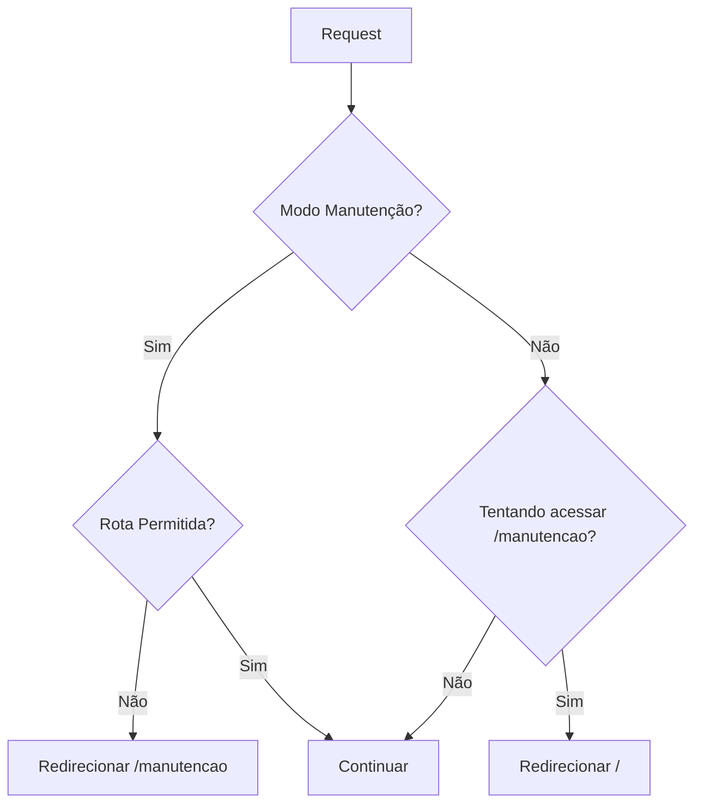
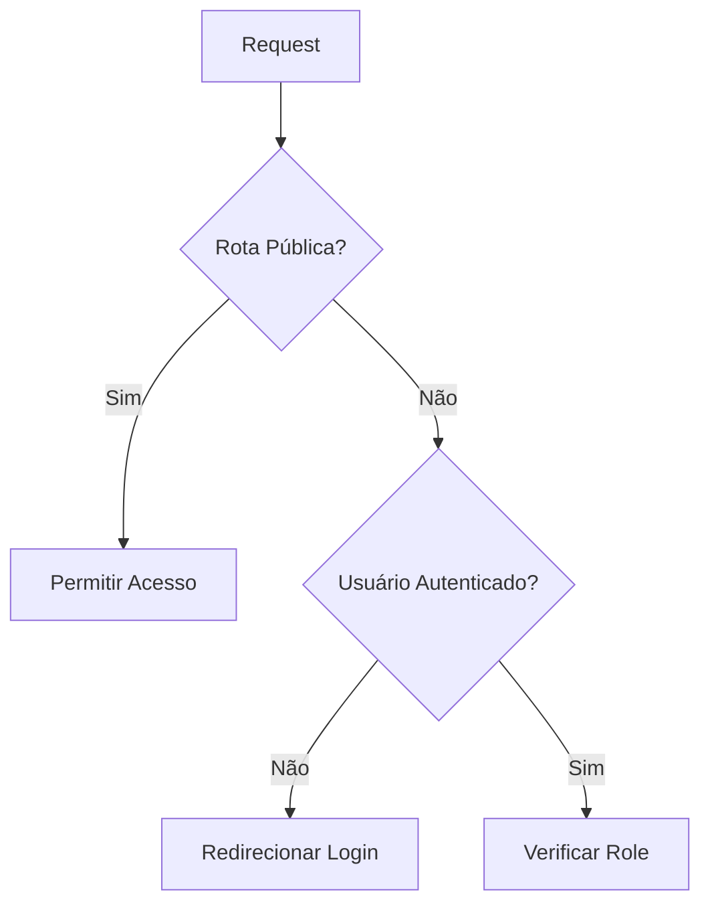
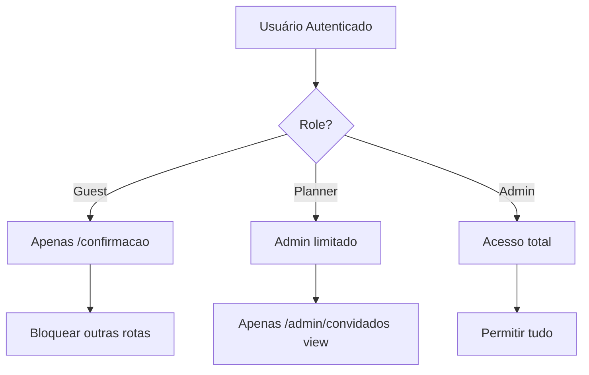

# Documentação do Middleware

Este documento descreve a implementação do middleware Next.js 15 para a aplicação de casamento, seguindo as melhores práticas atuais.

## 📋 Funcionalidades Implementadas

### 1. **Modo de Manutenção**

- ✅ Redirecionamento automático para `/manutencao` quando `MAINTENANCE_MODE=true`
- ✅ Proteção de rotas essenciais durante manutenção (auth, estáticos)
- ✅ Prevenção de acesso à página de manutenção quando modo está inativo

### 2. **Sistema de Autenticação**

- ✅ Integração com NextAuth
- ✅ Redirecionamento para login com callback URL
- ✅ Rotas públicas sem necessidade de autenticação

### 3. **Controle de Acesso por Role**

- ✅ **Guest**: Acesso apenas à confirmação
- ✅ **Planner**: Acesso limitado ao admin (apenas visualização de convidados)
- ✅ **Admin**: Acesso total à aplicação

### 4. **Headers de Segurança**

- ✅ Headers básicos de segurança
- ✅ Headers de debug em desenvolvimento
- ✅ Proteção contra clickjacking e XSS

## 🔧 Arquitetura Técnica

### Estrutura do Middleware

```typescript
export default auth(async req => {
  // 1. Verificação de modo de manutenção
  // 2. Rotas públicas
  // 3. Verificação de autenticação
  // 4. Controle de acesso por role
  // 5. Headers de segurança
  // 6. Retorno da resposta
})
```

### Matcher Configuration

```typescript
export const config = {
  matcher: ['/((?!api(?!/auth)|_next/static|_next/image|favicon.ico|sitemap.xml|robots.txt).*)'],
}
```

**O que o matcher inclui:**

- ✅ Todas as páginas da aplicação
- ✅ Rotas de API de autenticação (`/api/auth/*`)
- ✅ Rotas de confirmação dinâmicas

**O que o matcher exclui:**

- ❌ APIs gerais (`/api/*` exceto auth)
- ❌ Arquivos estáticos (`/_next/static/*`)
- ❌ Otimização de imagens (`/_next/image/*`)
- ❌ Arquivos de metadata (`favicon.ico`, `sitemap.xml`, `robots.txt`)

## 🛡️ Fluxo de Segurança

### 1. Verificação de Manutenção



### 2. Fluxo de Autenticação



### 3. Controle de Acesso por Role



## 🚦 Tipos de Usuário e Permissões

### **Guest (Convidado)**

- **Acesso Permitido:**
  - `/confirmacao/*` - Confirmar presença
  - Rotas públicas gerais
- **Acesso Negado:**
  - Área administrativa
  - Outras funcionalidades

### **Planner (Organizador)**

- **Acesso Permitido:**
  - `/admin/convidados` - Visualizar lista de convidados
  - Rotas públicas gerais
- **Acesso Negado:**
  - `/admin/convidados/novo` - Criar convidados
  - `/admin/convidados/*/editar` - Editar convidados
  - `/admin/presentes/*` - Gerenciar presentes
  - `/admin/usuarios/*` - Gerenciar usuários
  - Outras áreas administrativas

### **Admin (Administrador)**

- **Acesso Permitido:**
  - Todas as rotas da aplicação
  - Todas as funcionalidades administrativas

## 🔒 Headers de Segurança

O middleware adiciona automaticamente headers de segurança:

```typescript
// Headers de segurança básicos
response.headers.set('x-frame-options', 'DENY')
response.headers.set('x-content-type-options', 'nosniff')
response.headers.set('referrer-policy', 'strict-origin-when-cross-origin')

// Headers de debug (apenas em desenvolvimento)
if (process.env.NODE_ENV === 'development') {
  response.headers.set('x-user-role', userRole)
  response.headers.set('x-user-id', userId)
}
```

## 🛠️ Configuração e Uso

### Variáveis de Ambiente

```bash
# Ativar modo de manutenção
MAINTENANCE_MODE=true

# Configuração NextAuth
NEXTAUTH_SECRET="your-secret"
NEXTAUTH_URL="http://localhost:3000"
```

### Rotas Públicas Configuradas

```typescript
const publicRoutes = [
  '/', // Home
  '/localizacao', // Localização do evento
  '/presentes', // Lista de presentes
  '/mensagens', // Mensagens dos convidados
  '/nossa-historia', // História do casal
  '/confirmacao', // Confirmação de presença
  '/auth/login', // Login
  '/api/auth', // APIs de autenticação
]
```

## 🔄 Fluxo de Redirecionamento

### Cenários de Redirecionamento

1. **Modo Manutenção Ativo:**

   - `qualquer-rota` → `/manutencao`

2. **Usuário Não Autenticado:**

   - `rota-privada` → `/auth/login?callbackUrl=rota-original`

3. **Guest tentando acessar admin:**

   - `/admin/*` → `/confirmacao`

4. **Planner tentando acessar área restrita:**

   - `/admin/presentes` → `/admin/convidados`
   - `/admin/convidados/novo` → `/admin/convidados`

5. **Tentativa de acessar manutenção quando inativa:**
   - `/manutencao` → `/`

## 🧪 Testes e Debug

### Headers de Debug (Desenvolvimento)

```bash
# Verificar headers no navegador (DevTools > Network)
x-user-role: admin
x-user-id: user123
```

### Logs do Middleware

O middleware não gera logs automaticamente, mas você pode adicionar:

```typescript
// Adicionar após a linha const { pathname } = req.nextUrl
console.log(`[Middleware] ${req.method} ${pathname} - Role: ${userRole}`)
```

## 📚 Recursos e Referências

- [Next.js 15 Middleware Documentation](https://nextjs.org/docs/app/api-reference/file-conventions/middleware)
- [NextAuth.js Middleware](https://next-auth.js.org/configuration/nextjs#middleware)
- [Next.js Security Headers](https://nextjs.org/docs/app/api-reference/next-config-js/headers)

## 🔮 Melhorias Futuras

### Possíveis Implementações

- [ ] Rate limiting por IP
- [ ] Logs estruturados com Winston/Pino
- [ ] Middleware de monitoramento de performance
- [ ] Cache de verificações de role
- [ ] Whitelist de IPs para admin
- [ ] Middleware de analytics/tracking
- [ ] Validação de CSRF tokens
- [ ] Middleware de compressão customizado

### Flags Experimentais (Next.js 15.2+)

```typescript
// next.config.ts
export default {
  experimental: {
    nodeMiddleware: true, // Permitir Node.js runtime no middleware
  },
}

// middleware.ts
export const config = {
  runtime: 'nodejs', // Usar Node.js ao invés de Edge Runtime
}
```

## 🚨 Troubleshooting

### Problemas Comuns

1. **Loop infinito de redirecionamento:**

   - Verificar se as rotas públicas estão corretamente configuradas
   - Conferir se `/auth/login` está na lista de rotas públicas

2. **Headers não funcionando:**

   - Verificar se o matcher está capturando a rota
   - Confirmar que o middleware está sendo executado

3. **Modo manutenção não funciona:**

   - Verificar se `MAINTENANCE_MODE=true` está no `.env`
   - Reiniciar a aplicação após alterar variáveis de ambiente

4. **Roles não sendo respeitados:**
   - Verificar se o NextAuth está configurado corretamente
   - Confirmar se o campo `role` está sendo retornado na sessão
